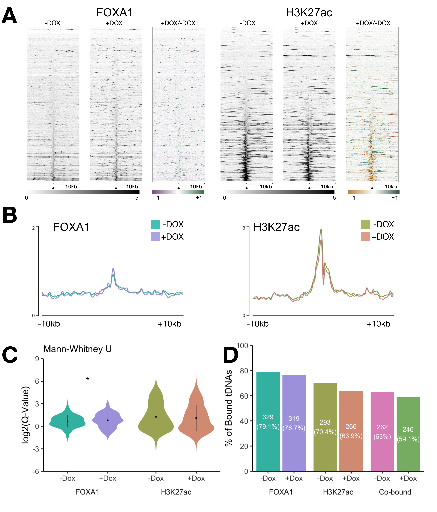
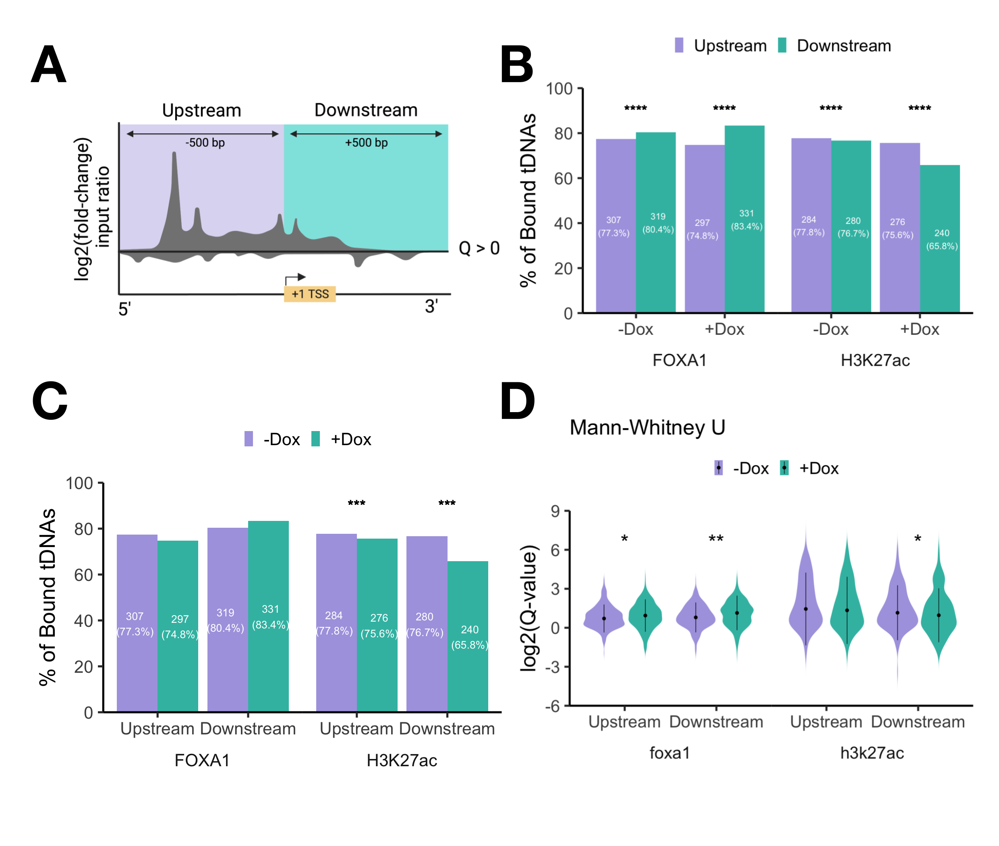

```{r setup, include=FALSE}
knitr::opts_chunk$set(
    echo = FALSE,
    message = FALSE,
    warning = FALSE,
    fig.align = "top",
    fig.pos = "p",
    out.width = '100%',
    fig.fullwidth = TRUE,
    fig.show = 'hold'
)
```

```{r load-pkgs, include=FALSE}
library(tidyverse) # Load the tidyverse. Functions are used for tidying data and creating plots via ggplot2.

library(kableExtra) # Load kableExtra. Table generation.

library(wordcountaddin) # Load wordcountaddin. Counts words and characters in text in an R markdown document.

library(rmdwc)

citation_count <-
    rmdcount(
        files = "report.Rmd",
        space = "[:space:]",
        word = "\\@",
        line = "\\n",
        exclude = "```\\{.*?```"
    )
```

```{r child = "abstract.Rmd"}
```

```{=tex}
\normalsize
\begin{flushright}
`r word_count("abstract.Rmd")` Words
\end{flushright}
\hrulefill\\
\setlength{\parindent}{10pt}
```
# Introduction

In 2020, female breast was the most commonly diagnosed cancer worldwide with over 2.2 million cases[@Sung2021].
Estrogen Receptor (ERα) drives 75% of breast cancers cancers[@allred2004].
Presence of ERα is generally prognostic of positive outcomes, due to its use as a therapeutic target.
Estrogen levels are lowered using endocrine therapies with aromatase inhibitors; fulvestrant, a selective estrogen receptor down regulator (SERD) which binds and degrades the ER, and tamoxifen, a selective estrogen receptor modulator (SERM) which competes with estrogen for binding to ER[@Johnston2018].
However, resistance to endocrine therapy occurs in 40-50% of tumours from 5 years of diagnosis[@Anurag2018], highlighting the need for new therapeutic targets.

Early studies demonstrated that Forkhead box A1 (FOXA1) maps to \~50% of ER-chromatin binding sites.
FOXA1 is a pioneer factor capable of directly initiating chromatin opening, facilitating binding of ERα and other transcription factors to DNA[@Costa1989; @Cirillo2002; @carroll2005; @laganière2005].
Furthermore, silencing of FOXA1 reduces \~95% ER binding events [@Hurtado2011; @carroll2005].
The presence of FOXA1 determines treatment response in ER+ breast cancer; FOXA1 is associated with positive prognoses following treatment with tamoxifen[@Hurtado2011; @Badve2007].
However, FOXA1 and ERα has also been found to be overexpressed in some ER+ endocrine resistant breast cancer lines[@ross-innes2012].
Studies have shown that amplification of FOXA1 promotes endocrine-resistant growth and invasiveness by reprogramming the ER-transcriptome[@fu2016].

Recently, ERα and FOXA1 have been shown to bind at tRNA genes[@malcolm2022; @fu2016].
Transfer RNA (tRNA), along with U6 snRNA and 5S rRNA, are products of RNA Polymerase III (Pol III)[@dieci2007].
In eukaryotes, transcription of DNA is tightly-regulated by three RNA polymerase enzymes.
Pol III, the largest of the three at 17-subunits[@vannini2012], produces a series of short non-coding RNAs[@dieci2007].
Approximately 80% of Pol III binding resides at tRNAs[@Raha2010a] --- adapters required to translate mRNAs into the amino acid protein sequence.
Initiation of tRNA transcription requires the binding of TFIIIC, a multi-subunit complex, to internal tRNA promoters, the A and B boxes, which are located downstream of the transcription start site [@Schramm2002; @Lassar1983; @Galli1981].
This protein-protein interaction enables the recruitment of the TFIIIB promoter, composed of the TATA-box-binding protein (TBP), BDP1, and BRF1 polypeptides [@schramm2000].
TFIIIB occupies the region upstream of the transcription start site and binds to Pol III directly through BRF[@Khoo1994], positioning it at the initiation region [@kassavetis1990].

Deregulation of Pol III is associated with a range of cancers[@Zhang2018; @Pavon-Eternod2009], including ovarian and breast[@Winter2000; @Krishnan2016].
In healthy cells, tumour suppressors such as retinoblastoma (RB) and p52 regulate Pol III transcription.
This is achieved through binding to TFIIIB, blocking interactions to both TFIIIC and Pol III[@White1996; @Cairns1998; @Sutcliffe2000; @Crighton2003].
Loss of RB and p53 in transformed cells consequently enhances Pol III transcription.
Contrarily, induction of onco-proteins MAP kinase Erk or c-Myc may stimulate Pol II expression through interactions with TFIIIB [@Gomez-Roman2003; @Felton-Edkins2003].
The relationship between Pol III and cell transformation directly implicates tRNAs in carcinogenesis.
Specific tRNAs have also been shown to drive cancer progression[@Goodarzi2016].
For example, overexpression of tRNA-Glu-TTC and tRNA-Arg-CCG has been shown to promote invasion through enhanced stability and up-regulation of metastatic promoters.
Overexpression of the transcription initiator tRNA-iMet alters global tRNA expression, increasing cell activity and proliferation[@Pavon-Eternod2013], as demonstrated in melanoma cells[@Birch2016].
Additionally, proteins containing selenocysteine are involved in Redox, which promotes tumour proliferation, linking tRNA-Sec transcription to tumourgenesis[@Sangha2022].

Aberrant expression of tRNAs in breast cancers has been observed in several studies[@Hah2011; @Krishnan2016; @Pavon-Eternod2009; @Zhang2018].
Upon stimulation by estrogen, ERα+ breast cancer cells undergo extensive transcriptional changes, upregulating 90% of tRNA genes[@Hah2011].
Additionally, ERα amplifies alcohol-induced deregulation of tRNA^Leu^ by in MCF-7 cells[@zhong2014].
As ERα+ BC is reliant on FOXA1, the aim of this study was to determine whether FOXA1 elevates tDNA expression.
To achieve this, a bioinformatics approach was taken to analyse publicly available FOXA1 and H3K27ac ChIP-seq datasets from Fu et al. (2019)[@fu2019] in the context of the MCF-7 cell line.
Here, identification of FOXA1 and H3K72ac co-localisation at tDNAs may provide insight into FOXA1's relevance in the altered tRNA expression associated with poor prognosis in ERα+ breast cancer.

# Materials & Methods

## ChIP-seq Data from NCBI

FOXA1 and H3K27ac ChIP-seq was performed on genetically modified MCF7L cells (*insertion, using a lentiviral cDNA delivery system to express Dox-inducible FOXA1*) by the lab of Xiaoyong Fu, Baylor College of Medicine, and made publicly available on Dec 18 2019[@fu2019].
Datasets were deposited into the National Centre for Biotechnology Information (NCBI) Sequence Read Archive (SRA) Run Selector[@leinonen2010] under the accession number PRJNA513000 (Available at <https://www.ncbi.nlm.nih.gov/sra> ; table \@ref(tab:data)).
Using "Genetic Manipulation Tools" within the Galaxy[@thegala2022] environment (v 23.0.rc1), SRAs were converted to FastQ files.
FastQ files were then aligned to the human genome assembly GRCh37 (hg19) by Bowtie2 (v 2.5.0)[@langmead2012] to output BAM files.

```{r data}
kbl(
  data.frame(
    "Experiment" = c(
      "PRJNA513000",
      "",
      "",
      "",
      "",
      "",
      ""
    ),
    "SRA" = c(
      "SRR8393424",
      "SRR8393425",
      "SRR8393426",
      "SRR8393427",
      "SRR8393428",
      "SRR8393431",
      "SRR8393432"
    ),
    "Factor" = c(
      "FOXA1",
      "",
      "",
      "H3K27ac",
      "",
      "None (input)",
      ""
    ),
    "Tissue" = c(
      "MCF-7LP",
      "",
      "",
      "",
      "",
      "",
      ""
    ),
    "Assembly" = c(
      "GRCh37 (Hg19)",
      "",
      "",
      "",
      "",
      "",
      ""
    )
  ),
  
  booktabs = TRUE,
  caption = "Publicly available ChIP-seq SRA files aquired from the NCBI SRA database (accession no. PRJNA512997).",
  format = "markdown"
)
```

## EaSeq for the Quantification of Signals at tDNAs

BAM files were uploaded into EaSeq (v1.111) as "Datasets" using the standard settings for Chip-seq data.
GRCh37 (hg19) tRNA sequences (n = 606) were downloaded as a "Geneset" from the UCSC Table Browser[@Karolchik2004], (available at <https://genome.ucsc.edu>).
High-confidence tRNAs (n = 416) identified by the GtRNAdb[@Chan2016] were extracted as a "Regionset"; this group tRNAs does not include tRNA-derived repetitive elements and have been determined most likely to be functional in translation.

Signal peak intensities surrounding tRNAs were quantified using the EaSeq "quantify" tool.
Here the default settings "Normalize to reads per million" and "Normalize counts to DNA-fragments" were left checked.
The default setting "Normalise to a signal of 1000 bp" was unchecked.
The window size was offset ±500bp from the start of each tRNA gene.
Generated values are referred to as "Q-values".

To quantify upstream and downstream signals, the "quantify" tool was used with adjusted window sizes.
The upstream region was defined as 500 bp preceding and the first nucleotide of tRNA loci.
Thus, the start position was offset to 0 bp, and the end position was offset to -500 bp.
The downstream region constitutes the 500 bp region beginning with the first nucleotide of tRNA gene body.
The start position was offset to 1 bp, and the end position was offset to 500 bp.
Following quantification, tRNA binding events were arranged in ascending order of -Dox Q-value and visualised as heatmaps.
Data was also visualised with the "heatmap", "average", "overlay", and "fill-track" tools (Figure \@ref(fig:methods)).
EaSeq[@lerdrup2016] is available at <http://easeq.net>.

```{r methods, out.width = '100%', fig.cap = "Overview of bioinformatic pipeline for FOXA1 and H3K27ac ChIP-sew analysis at high confidence tRNA genes. ChIP-seq analysis was performed in doxycycline incucible FOXA1 OE MCF-7 cells and analysed in EaSeq. In Galaxy, datasets were aquired from NCBI SRA, aligned to hg19 by Bowtie, and coverted to BAM files. tRNA annotations were obtained from UCSC, and the high convidence tRNAs subset was provided by gtRNAdb. tDNAs were visualised in EaSeq using heatmap, average, and filltrack tools. Figure adapted from Malcolm et al (2022)."}

```

## Motif Analysis

Motif analysis was carried out by the MEME Suite[@Bailey2015] (V 5.5.2; available at: [https://meme-suite.org](https://meme-suite.org/)).
De Novo motifs were searched via MEME-SEA, and location preference via MEME-CentriMo.
tDNA sequences and their were acquired from the UCSC Table Browser[@Navarro2021] and supplied to the MEME-Suite[@Bailey2015].
Specific motifs were acquired from JASPAR[@Castro-Mondragon2022] and Moqtaderi et al. (2010)[@Moqtaderi2010].

## Statistics

Statistical analysis and visualisation was generated with R[@r] (v 4.2.3) with the tidyverse[@wickham2019] and ggpubr[@ggpubr] packages.
Group differences were determined by Mann-Whitney U, Wilcoxon signed-rank test, and the Chi-squared test.

## ChIP-Seq and ChIP-qPCR

MCF-7L cells were grown in PRF medium with 5% CS-FBS and −/+ Dox.Cells were cross-linked with 1% formaldehyde for 10 mins.
Cross-linking was inhibited by quenching (1/20V, 125 mM glycine).
Cells were washed in cold PBS and harvested in cold PBS with protease inhibitors (Roche).
Pelleted cells were re-suspended in cytosolic and then lysed in nuclear lysis buffer (10-20 min), and sheared at high output (Bioruptor, Diagenode; 4 °C, 30s per sonication cycle for 20 min).
Sonicated lysates were cleared by centrifugation (20,000 × g, 10 min) and diluted (4 times) before pre-incubation with protein-A/G beads (Santa Cruz; 4 °C, 30 min).

ChIP was performed by overnight incubation (4 °C) with antibody against human FOXA1 (Abcam, ab23738) or H3K27ac (Active Motif, #39134), followed by an additional incubation with protein-A/G beads (1h).
For FOXA1 ChIP-seq, spike-in Drosophila melanogaster chromatin was added with the antibody against histone variant H2Av (Active Motif, \# 61752).
The beads were washed with low and high salt wash buffer, once with LiCl wash buffer (20 mM Tris pH 8.0, 1 mM EDTA, 250 mM LiCl, 1% Nonidet P-40, 1% sodium deoxycholate), and once with TE buffer.
DNA was eluted (50 mM NaHCO3 and 1% SDS) and then supplemented with NaCl (300 mM).
Cross-links were reversed by incubating overnight (67 °C).
RNA was digested at 37 °C with RNase A (0.1 mg/mL, 30 min).
DNA was purified with a PCR purification kit (Qiagen).

Indexed libraries were prepared from ChIP DNA using the KAPA Hyper Library Preparation Kit (Kapa Biosystems).
Libraries were amplified by PCR (12 cycles), and then assessed for size distribution using the 4200 TapeStation High Sensitivity D1000 ScreenTape (Agilent Technologies) and quantified using the Qubit dsDNA HS Assay Kit (ThermoFisher).
The indexed libraries were multiplexed, 10 libraries per pool.
Real time quantitative PCR (qPCR) was perfomed using the KAPA Library Quantification Kit (KAPA Biosystems) and then sequenced on the Illumina NextSeq500 using the high-output 75 bp single-read configuration.

------------------------------------------------------------------------

# Results

## Localisation of FOXA1 and H3k27ac at tRNA genes in MCF-7 cells

To investigate whether FOXA1 enhances tDNA expression, a Doxycycline (Dox) inducible OE system in MCF-7 cells was used to achieve FOXA1 OE comparable to endogenous MCF7 tamoxifen-resistant cells (TamR).
ChIP-seq analysis was carried out for FOXA1 and H3K27ac.
H3K27ac denotes accessible chromatin and is used to identify active promoters, so, H3K27ac signal was used a proxy to measure activity.

To explore whether FOXA1 can alter tDNA activity, mapped reads of FOXA1 and H3K27ac binding was quantified (Q-values) relative to ±500 bp flanking regions.
Binding events were visualised as heatmaps and ordered by increasing -Dox Q-value.
This revealed a binding signal of FOXA1 and H3K27ac at approximately half of tDNAs, relative to ±10 kb flanking regions.
Upon FOXA1 induction, FOXA1 enrichment increases at a small proportion of tRNAs genes.
H3K27ac enrichment decreases at approximately half of tRNA genes (Figure \@ref(fig:results-1)A).
This was confirmed by average signal intensity plots of FOXA1 and H3K27ac binding (Figure \@ref(fig:results-1)B).
Input reads generated minimal peak enrichment (Supplementary Figure 1).
FOXA1 enrichment statistically increased in response to FOXA1 induction.
Median FOXA1 Q-values were (Figure \@ref(fig:results-1)D) increased 10.9% (p = 0.021).
For H3K27ac, median Q-values decreased by 1.1%, however this change was not statistically significant (Figure \@ref(fig:results-1)D).

Peaks were classified as binding events if Q-values exceeded input values (log~2~(Q-value fold-change) \>0) (Figure \@ref(fig:results-1)C).
Before FOXA1 OE, FOXA1 interacts with 329 tRNA genes and H3K27ac with 293 tRNA genes.
The majority of these events are co-binding, with both FOXA1 and H3K27ac binding to 262 tDNAs.
Upon FOXA1 OE, the number of FOXA1 binding sites decrease to 319; 40 are lost and 30 are gained, whilst 309 pre-existing sites remained.
H3K27ac sites also decrease to 266 tDNAs; 50 are lost and 23 are gained, whilst 239 pre-existing sites remained.
Co-binding events lower to 246; 44 are lost and 28 are gained, whilst 230 pre-existing sites remained.
Together, these results support the notion that FOXA1 and H3K27ac bind to tDNAs.

```{r results-1, out.width = '100%', fig.cap = "Comparisons of FOXA1 and H3K27ac binding at tDNAs, with or without Dox.(A) Heatmaps of FOXA1 and H3K27ac across hg19 tRNA genes in MCF-7 cells. Genes arranged in order of increasing -Dox Q-value. Ratiometric heatmaps represent the log2 ratio between -Dox and +Dox peaks. Windows represent ±10kb from the centre of the gene. N = 416. (B) Average signal intensity overlay of FOXA1 and H3K27ac. Windows represent ±10kb from the centre of the gene. (C) Violin plots of FOXA1 and H3K27ac Q-values within ±500bp of the gene body. *p < 0.05.(D) Bar plots of the percentage of tDNAs bound by FOXA1 and H3K27ac. "}

```

## FOXA1 overexpression induces FOXA1 and H3K27ac enrichment at tDNAs

To elucidate how FOXA1 impacts tDNA levels, tDNAs that were differently enriched upon FOXA1 OE were categorised as having gained (UP) enrichment if fold-change \> 1.5 and lost (DN) enrichment if fold-change \< 0.5 (*P*-value \> 1e-3).
This discovered that substantially more tDNAs gained (UP) FOXA1 enrichment than lost (DN) (96 vs. 62), whilst 258 tDNAs remained relatively unchanged (Figure \@ref(fig:results-2)A, left).
Median FOXA1 Q-values decreased by 42.7% at DN tDNAs, and increased 90% at UP tDNAs.
For H3K27ac, FOXA1 OE led to 54 tDNAs gaining (UP) enrichment and 124 losing (DN) enrichment (Figure \@ref(fig:results-2)A, right), whereas 236 tDNAs remained relatively unchanged.
Median H3K27ac Q-values decreased by 26.4% at DN tDNAs, and increased 81.5% at UP tDNAs.
Q-values of both FOXA1 and H3K27ac were significantly increased or decreased at UP and DN tDNAs, respectively (Figure \@ref(fig:results-2)B).
Of tDNAs that significantly gain FOXA1 or H3K27ac (n = 150), 14% gain both (Figure \@ref(fig:results-2)C).
Examples of exclusive and co-bound tDNAs are shown in Figure \@ref(fig:results-2)D.

```{r results-2, out.width='100%', fig.cap = "FOXA1 OE impacts binding of FOXA1 and H3K27ac at tRNA genes. (A) Volcano plots of FOXA1 (n = 416) and H3K27ac (n = 414) Q-values at tDNAs in +Dox vs. −Dox cells. (Left) The purple and green dots correspond to the regions with gained (UP) and lost (DN) FOXA1 enrichment, respectively. (Right) The orange and green dots correspond to the regions with gained (UP) and lost (DN) H3K27ac enrichment, respectively. The threhold for calling was set fold-change > 1.5 and P < 1e-3. (B) Violin plots of the Q-values of gained (UP) or lost (DN) enrichment of H3K37ac or FOXA1 at tRNA genes. ****p < 0.0001. (C) Venn diagram representing the overlap between increased FOXA1 and H3K27ac enrichment regions. (D) Filltrack examples of seperate and co-occuring FOXA1 and H3K27ac enrichment events within ± 2 kb of tDNAs. The black line represents the gene body."}
knitr::include_graphics("../images/results-02.png")
```

## FOXA1 overexpression activates tDNAs

The next step was to investigate the impact of FOXA1 on tDNA activity.
Almost half of human tDNAs are silent or poorly expressed [@Torres2019].
Thus, tDNAs were classified as 'active' if H3K27ac Q-values exceeded the median value for non-induced cells, and 'inactive' if Q-values were below the median (Median = 1.808).
The enrichment of H3K27ac at inactive tDNAs was somewhat altered (p = 0.043), with median FOXA1 Q-values decreasing 4.9% (Figure \@ref(fig:results-3)A).
The enrichment of active tDNAs did not significantly change, though the median Q-value did decrease 18.9%.

Upon FOXA1 OE, 27 tDNAs became inactive (LOSS) and 26 became activate (GAIN) (net change = 1) (Supplementary Figure 2).
Whilst the activity status of 363 (87.3%) tDNAs remained not changed (NC) (Figure \@ref(fig:results-3)B).
The H3K27ac enrichment of activated (GAIN) tDNAs was significantly increased 65.4% upon FOXA1 OE (Figure \@ref(fig:results-3)C).
H3K27ac enrichment decreased 14.2% for inactivated (LOSS) tDNAs, and decreased 8.3% for no-change (NC) tDNAs.
However, these changes were not significant for the last two categories.

tDNAs that were activated (GAIN) or inactived (LOSS) by FOXA1 OE were superimposed with tDNAs that significantly gained FOXA1 or H3K27ac enrichment with FOXA1 OE (UP/DN) (Figure \@ref(fig:results-2)C).
This revealed that, of the FOXA1 OE-activated tDNAs, 19 of 26 also reasonably gained H3K27ac enrichment, and 13 of 26 reasonably gained FOXA1 enrichment (Figure \@ref(fig:results-3)D).
Whereas 16 tDNAs gained both H3K27ac and FOXA1 enrichment but not activity.
Only 9 tDNAs gained activity as well as H3K27ac and FOXA1 enrichment.
Examples of activated tDNAs with increased H3K27ac, FOXA1, or both, are shown in Figure \@ref(fig:results-3)E.

```{r results-3, out.width = '100%', fig.cap = "(A) Violin plot of H3K27ac Q-values within ±500bp of the gene body of inactive and active tDNAs. *p < 0.05. (B) Barplot of tDNAs catagorised by activity change upon FOXA1 OE. tDNAs are classed as inactivated (LOSS), no-change (NC), and activated (GAIN). (C) Violin plot of tDNA Q-values, catagorised as they are in B. *p < 0.05, **p < 0.01. (D) Venn diagram representing the overlap between tDNAs classed as activated (GAIN) or enriched in FOXA1 or H3K27ac (UP) upon FOXA1 OE. (E). Filltrack examples of co-occuring FOXA1 enrichment (UP), H3K27ac enrichment (UP), and activation (GAIN) events within ± 2 kb of tDNAs. The black line represents the gene body."}

```

## Binding of FOXA1 downstream correlates to H3K27ac binding upstream

To assess FOXA1 and H3K27ac binding preference, the levels of FOXA1 and H3K27ac at upstream and downstream regions were quantified within a ± 500 bp (Figure \@ref(fig:results-4)A).
The upstream window was classified as the 500 bp region preceding the tDNA loci, including the TSS.
In contrast, the 500 bp region preceding the TSS defined the downstream region.
When comparing site location, FOXA1 was found to bind at more tDNAs at downstream sites than upstream sites, both with FOXA1 OE and without (307 vs 319; 297 vs 331) (Figure \@ref(fig:results-4)B).
FOXA1 OE decreased the number of binding sites upstream (307 vs 297), and increased the number of binding sites downstream (319 vs 331) , though this was not significant (Figure \@ref(fig:results-4)C).
Contrarily, H3K27ac bound at significantly more tDNAs upstream sites than downstream, both with FOXA1 OE and without (-Dox 284 vs 280; +Dox 276 vs 240) (Figure \@ref(fig:results-4)B).
This pattern of binding was further perpetuated by FOXA1 OE; Q-values significantly decreased 3.8%% upstream and 14.3% downstream (Figure \@ref(fig:results-4)C).

```{r results-4, out.width = '100%', fig.cap = "(A) Schematic of the independent quantification of the upstream and downstream regions of tDNAs. Windows were confined to the ±500 bp, including the gene body. Binding events were counted if Q-values exceeded the input values. (B) Violin plot of the upstream and downstream Q-values for FOXA1 and H3K27ac, with or without Dox. (C)"}

```

## FOXA1 and ERE motifs are present at activated tDNAs

Motif analysis was conducted to investigate the binding mechanism directing FOXA1 to tRNA genes (Figure \@ref(fig:results-5)A).
The subset included tDNAs that, upon FOXA1 OE, significantly gained FOXA1 enrichment (FOXA1 UP), H3K27ac enrichment (H3K27ac UP), and gained activity (GAIN) (n = 9).
Investigation of *De Novo* motifs at these tDNAs revealed 27 enriched motifs, relative to random control sequences.
Top binders included MITF, SP2, TAF1, and SP1.
Interestingly, the androgen receptor (AR) was also discovered in this subset.
A specific search found FOXA1 (8 of 9), ERE (7 of 9), AP1 fos::jun (4 of 9), and SP1 (9 of 9) motifs to be enriched.
However, no motifs were discovered to be enriched at particular locations (data not shown).
The searches included the ±500 bp up- and downstream regions of tDNAs.
Test functionality was confirmed by enrichment of the conserved A box at all genes in this subset (Supplementary 3).

```{r results-5, out.width = '100%', fig.cap = "FOXA1 and ERE bindings motifs are located at tDNAs (A) Schematic of the motif enrichment analysis process carried out in MEME Suite.(B) The most highly enriched de novo motifs identified by MEME-SEA. (C) The enrichment of specific de novo motifs."}

```

## FOXA1 overexpression at cancer implicated tDNAs

The influence of FOXA1 OE on cancer-implicated tRNAs was analysed.
This included the iMet[@Pavon-Eternod2013; @Wang2018], Met, Arg-CCG[@Goodarzi2016], Gly-TTC[@Goodarzi2016], and Sec-TCA[@Sangha2022] families; the ALOXE3[@sizer2022], TMEM[@sizer2022], Per1[@raab2011], and Ebersole[@Ebersole2011; @sizer2022] clusters; and the Hes7[@raab2011]tRNA.
These tDNAs and their speculated functions are outlined in Table \@ref(tab:clusters).
In this selection of tRNAs, FOXA1 OE altered the activity of only a few genes.
Activity was gained at 5 tDNAs; two belong to the Glu-TTC family, another two to the Ebersole cluster, and one to the MET family (Table \@ref(tab:clusters)).
On the other hand, activity was lost at 3 tDNAs, belonging to the Met and Glu-TTC families, and the ALOXE3 cluster.
Both FOXA1 and H3K27ac enrichment increased at 12 tDNAs.
However, this was only significant at tRNA-Glu-TTC-4-1, tRNA-iMet-CAT-1-6, and tRNA-Met-CAT-3-1 (Fold-change \>1.5).
These results imply that FOXA1 OE does not modify activity at the majority of these tDNAs.

```{r clusters}
load("../environments/trna.RData")
kableExtra::kable(
    df,
    format = "latex",
    booktabs = TRUE,
    longtable = T,
    caption = "FOXA1 OE did not significantly alter tDNAs with implications in cancer development.",
    col.names = c("Group",
                  "Function",
                  "tRNAs",
                  "-Dox",
                  "+Dox",
                  "FOXA1",
                  "H2K27ac")
) %>% kableExtra::collapse_rows(
    columns = 1:3,
    latex_hline = "major",
    valign = c("top"),
    target = 1,
) %>%
    kableExtra::add_header_above(c("", "", "", "Activity" = 2, "Fold-Change" = 2)) %>%
    kableExtra::kable_styling(latex_options = c("scale_down", "repeat_header"),
                              font_size = 10) 
```

------------------------------------------------------------------------

# Discussion

In MCF-7 cells, tRNAs are extensively upregulated by the expression of estrogen[@Hah2011].
The function of the estrogen receptor (ERα) is dependent on FOXA1[@laganière2005; @carroll2005], however, a relationship between FOXA1 and tRNAs has not yet been established.
The aim of this project was to determine whether FOXA1 increases the activation of tRNA genes, as inferred by H3K27ac.
This analysis of ChIP-seq datasets provides evidence that over-expression of FOXA1 regulates tRNA gene activation; revealing a subset of tDNAs which significantly gain FOXA1 and H3K27ac upon FOXA1 OE, whilst also shifting from an inactive to active chromatin state.

## FOXA1 OE reprograms FOXA1 and H3K27ac binding at tRNAs genes

FOXA1 and H3K27ac was found at the majority of tDNAs.
Generally, FOXA1 OE decreased the number of FOXA1- and H3K27ac-binding events at tDNAs.
FOXA1 binding coincided with the approximately 60% of H3K27ac marks, slightly decreasing with FOXA1 OE (Figure \@ref(fig:results-1)).
Considerably more tDNAs gained than lost FOXA1 enrichment, with 15% losing and 23% gaining a significant amount of FOXA1.
The difference between gained and lost H3K27ac enrichment was more extensive.
Sufficient gain of H3K27ac enrichment constituted to 13% of tDNAs, whilst loss of H3K27ac was observed at 30%.
These results were unanticipated, as FOXA1 OE corresponds to an increase in H3K27ac in protein coding genes [@Cirillo2002].
However, it is noteworthy that tDNAs which gain H3K27ac enrichment do so at a higher magnitude than those that lose H3K27ac (Figure \@ref(fig:results-3)B).
Only 25 (6%) tDNAs experienced a compelling increase in both FOXA1 and H3K27ac binding intensity upon FOXA1 OE (Figure \@ref(fig:results-3)C).
This was an abrupt finding, as ChIP-Seq analysis by Fu et al. (2016)[@fu2016] found that increased FOXA1 intensity corresponds to an increase in H3K27ac intensity at 15% of events.
Though, this disparity in results is likely due to the difference in gene subsets, as this study focuses enhancer genes.

Of these tDNAs, 9 changed from an inactive to active state (Figure \@ref(fig:results-4)D).
On average, FOXA1 OE inactivated tDNAs with high levels of H3K27ac, whereas tDNAs with low H3K27ac levels were activated (Figure \@ref(fig:results-4)C).
Since fold-change was as used determine a significant change in binding enrichment, this may explain why larger increases are seen for increased H3K27ac.
Approximately 50% of tRNAs are silenced or poorly expressed[@Torres2019].
Therefore, the median H3K27ac Q-value of non-induced tDNAs was chosen as the threshold for determining activity.
However, H3K27ac binding alone is not sufficient for the identification of open chromatin[@Creyghton2010;], nor is it confirmation of tRNA transcription.
So, the impact of FOXA1 on tDNA activation identified in this study remains unresolved.
The affect of FOXA1 on chromatin accessibility would be better established by ATAC-seq, which has previously been demonstrated in prostate cancer[@Adams2019].
Implementing a ChIP-qPCR of Pol III would also provide clearer insight of FOXA1-induced tDNA transcription, whilst a qPCR of tRNA expression would identify tDNAs that are highly induced by FOXA1.

FOXA1 was observed to preferentially bind downstream, whilst more H3K27ac binding events occurred upstream (Figure \@ref(fig:results-5)B).
This pattern of H3K27ac binding was further perpetuated by FOXA1 OE, with H3K27ac decreasing downstream (Figure \@ref(fig:results-5)C).
However, FOXA1 binding preference was not changed by FOXA1 OE. It is not known why FOXA1 would bind distinctly to H3K27ac marks, though FOXA1 OE may recruits histone acetyltransferases upstream of FOXA1 binding.

The binding of FOXA1 and H3K27ac was analysed in several groups of tRNAs involved in cancer development.
Overexpression of FOXA1 did not significantly alter FOXA1 or H3K27ac binding at the majority of these tDNAs.
Only 3 activated tDNAs experienced a significant increase in both FOXA1 and H3K27ac enrichment.
Approximately 50% of these tRNA genes are active before induction of FOXA1 OE --- though evidence does not point towards contribution to a tamoxifen-resistant phenotype, their activity in MCF7 cells warrants further investigation.

## Motifs to Mechanisms

To elucidate how FOXA1 binds to tRNAs, enrichment analysis was carried out on the 9 activated tDNAs which significantly gain FOXA1 and H3K27ac.
ERα relies upon FOXA1[@carroll2005]; ERE motifs have recently been established at tRNA genes in ERα breast cancer [@malcolm2022], yet the presence of the forkhead motif has remained unresolved.
Numerous *de novo* motifs were identified, many of which are transcription factors.
Top binders including MITF, SP2, and TAF1 --- investigation is warranted to establish a relationship between these binders with tRNAs.
Interestingly, the binding motif of the Androgen Receptor (AR) was also identified at 5 of 9 tDNAs.
The AR drives prostate cancer, which is also promoted by FOXA1 OE[@gerhardt2012].

Specific motif analysis was carried out to identify FOXA1 motifs, followed by ERα and ERα tethering proteins, AP1 (fos::jun) and SP1.
FOXA1 motifs were present in 8 of 9 tDNAs, with the exception of tRNA-Glu-TTC-4-1.
Interestingly, the 7 ERE motifs identified in this subset were only located at tDNAs which contained a FOXA1 motif.
ERα tethering proteins AP1 (fos::jun) and SP1 were also found at 4 of 9 and 9 or 9 tDNAs, respectively.
This discovery introduces anew possibility of ERα binding to tDNAs, both directly and indirectly via AP1 and SP1, which may explain why many tRNAs are bound by ERα whilst lacking an ERE motif[@malcolm2022].
Another possibility includes distal binding though chromatin looping, which can occur from up to 1Mb from the TSS[@fullwood2009], though this has not yet been demonstrated in tDNAs.
This could explain why tRNA-Glu-TTC-4-1 and tRNA-Ser-CGA-3-1 lack an ERE motifs, though this likely due to such a narrow tDNA windows (±500).
This project did not address the role of FOXA1 in ERα --- analysing ERα binding at FOXA1 induced tDNAs is of utmost importance in establishing a role in tamoxifen-resitance.This too could be addressed by ChIP-seq.

# Conclusion

Through the interrogation of publicly available ChIP-seq datasets, a novel relationship between FOXA1 OE and H3K27ac binding at tRNA genes has been determined.
Binding of FOXA1 at tDNAs correlates with an overall decrease in H3K27ac enrichment.
However, FOXA1 OE activated tDNAs with significant gain in FOXA1 and H3K27ac enrichment were also identified.
This subset is enriched in binding motifs of FOXA1 and ERE; both FOXA1 and ERα have the capacity to directly bind to tDNAs, though the presence of ER-tethering proteins AP1 and SP1 introduce potential for ERα distal binding.
Due to the limitations of using H3K27ac as a predictor of tDNA activation, the consequences of FOXA1 OE on tDNA activity remains undetermined.
Nonetheless, the FOXA1 and H3K27ac modifications induced by FOXA1 OE are adequate evidence to permit further investigation into FOXA1 as a driver of tRNA transcription regulation in tamoxifen-resistant cells.

# Acknowledgements

I would like to express my thanks to my project director, Professor Robert J. White, for his supervision, guidance, and feedback during this project.
This project would not have been possible without Sienna P. Butterfield, who provided mentorship, direction, and support during my research.
I would also like to extend my thanks to Rebecca E. Sizer for her advice, support, and guidance in conducting motif analyses.

```{=tex}
\begin{flushright}
`r word_count("report.Rmd")` Words
\end{flushright}
\footnotesize
```

------------------------------------------------------------------------

# References
