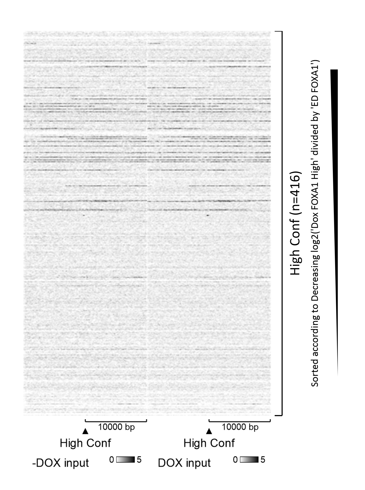
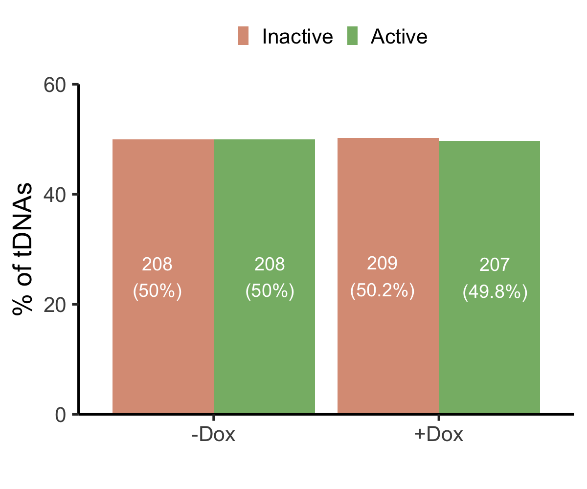
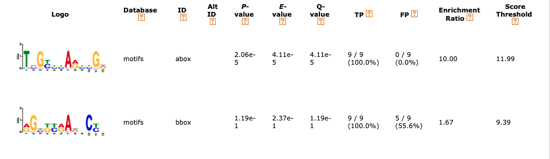

```{r setup, include=FALSE}
knitr::opts_chunk$set(
    echo = FALSE,
    message = FALSE,
    warning = FALSE,
    fig.align = "top",
    fig.pos = "p",
    out.width = '100%',
    fig.fullwidth = TRUE,
    fig.show = 'hold'
)
```

```{r}
library(tidyverse) # Load the tidyverse. Functions are used for tidying data and creating plots via ggplot2.

library(kableExtra) # Load kableExtra. Table generation.

library(wordcountaddin) # Load wordcountaddin. Counts words and characters in text in an R markdown document.

library(rmdwc)
```

```{r 2, out.width = '100%', fig.cap = " Heatmaps of -Dox and +Dox input peaks at hg19 tRNA genes in MCF-7 cells. Windows represent ±10kb from the centre of the gene. N = 416. "}

```

```{r 1, out.width = '100%', fig.cap = "Bar plot of the percentage of active and inactive tDNAs with or without FOXA1 OE"}

```

```{r 3, out.width = '100%', fig.cap = "MEME-SEA output of A and B box promoter sequences identified in activated tDNAs which significantly gained both FOXA1 and H3K27ac enrichment."}

```
